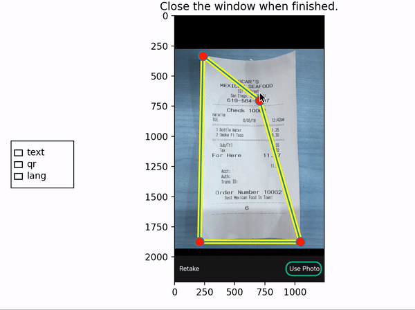
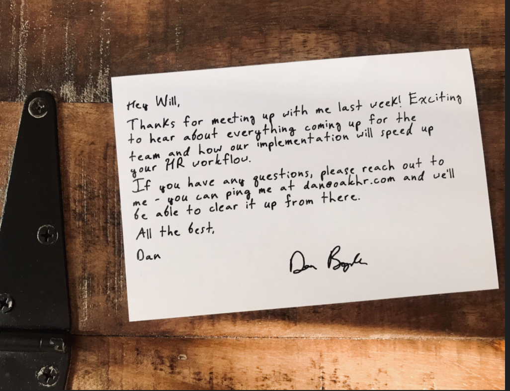
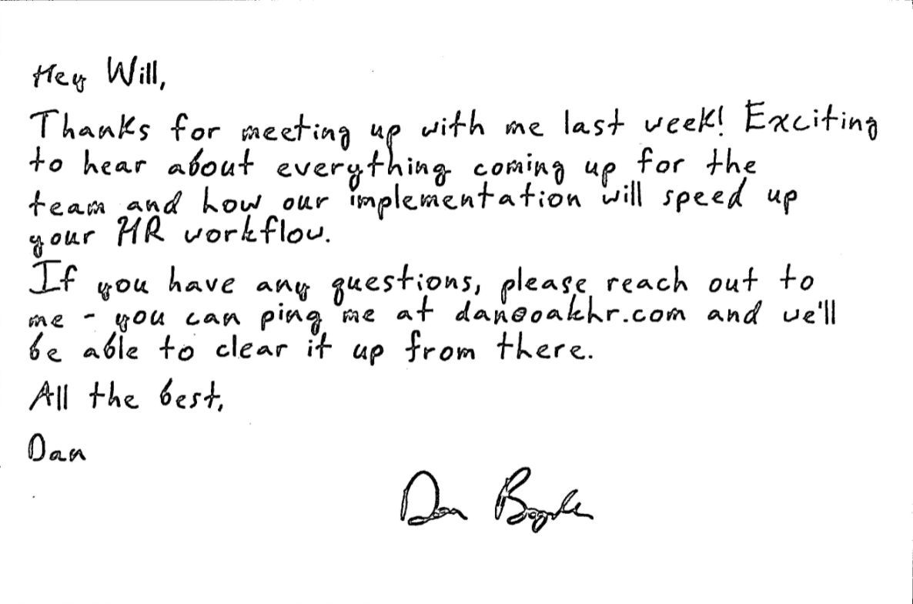
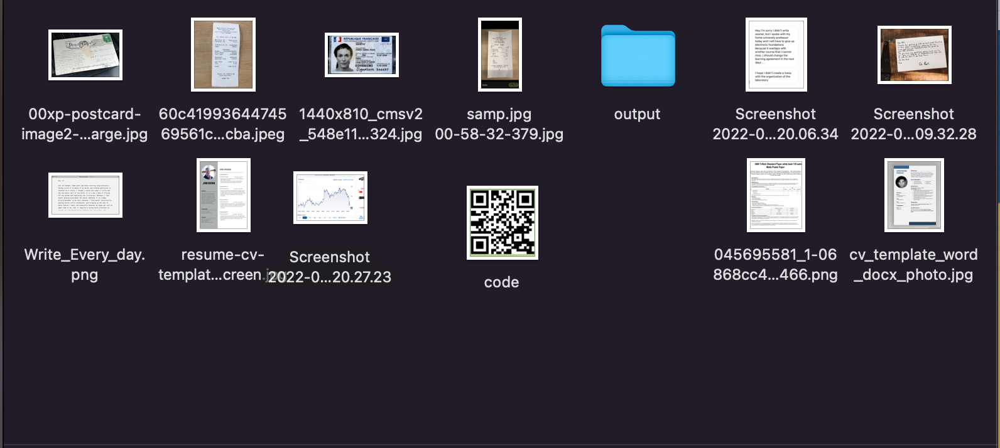
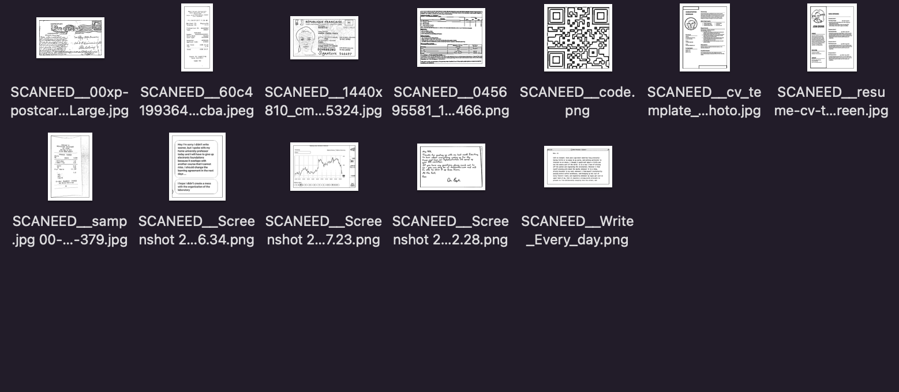

# Document-Scanner

 Docoument Scanner written in Python, mostly using cv2 library. The scanner takes a poorly scanned image, finds the corners of the document, applies the perspective transformation to get a top-down view of the document.
 ## Description
 What i had in my mind was the idea that i don't want to create another simple Document Scanner, so I asked myself what features I can add to make this project more interesting and more challeching.
 I came up with several concepts which later I implemented.
 - scanning whole directory by using one command
 - text scanner
 - creating Neural Network for Language Recognition
 - QR code Scanner 
 - interactive as also automatic selection of documents

 Supported Languages: German, English, French, Italian, Portuguese and Spanish. NN correctly detects the languegage of the text 97% of the time. Check `/src/language/langNN.ipynb` for more information.

 The UI code for the interactive mode is adapted from `interacrer.py` from matplotlib [page](https://matplotlib.org/examples/event_handling/poly_editor.html).


 ## Usage
 ```
 python scan.py (--images <IMG_DIR> | --image <IMG_PATH>) [-i] [-t] [-l] [-q] 
 ```
 * The `-i` flag enables interactive mode, where you will be prompted to click and drag the corners of the document. For example, to scan a single image with interactive mode enabled
 * The `-t` flag enables the text scanner, if text is found it is saves to txt file
 * The `-l` flag enables the language recognition, if languge is recognised than the its acronym is add to the scanned filename. 
 * The `-q` flag enables the QR scannar, scanned code is also added to the scanned filename.


 ## Examples
 Here are some examples of images before and after scan:
 <p align="center">
 
 </p>
 <p align="center">
   
   
 </p>
 <p align="center">
   
   

 </p>


 ## License

 [MIT](https://choosealicense.com/licenses/mit/)
